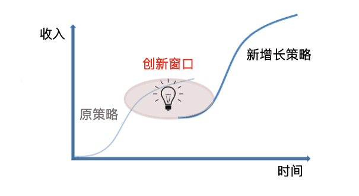
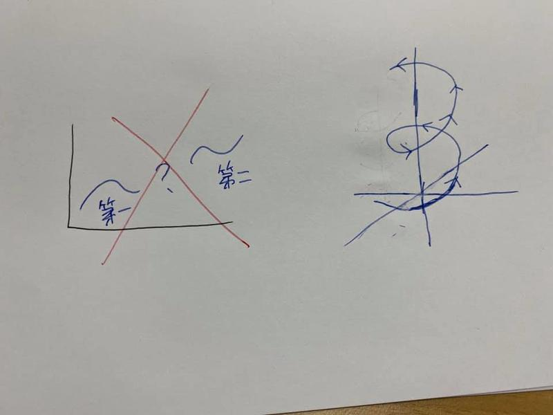
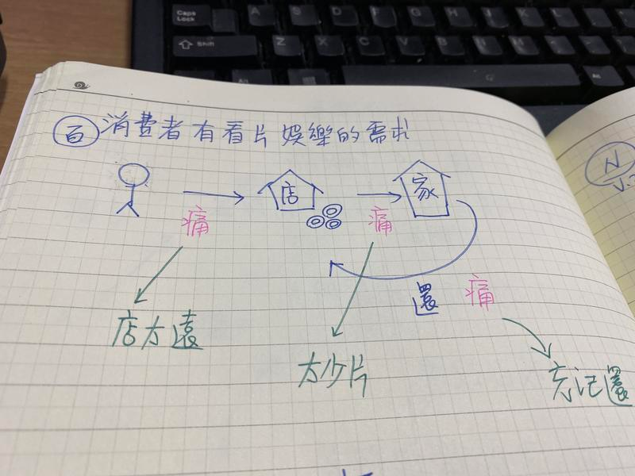
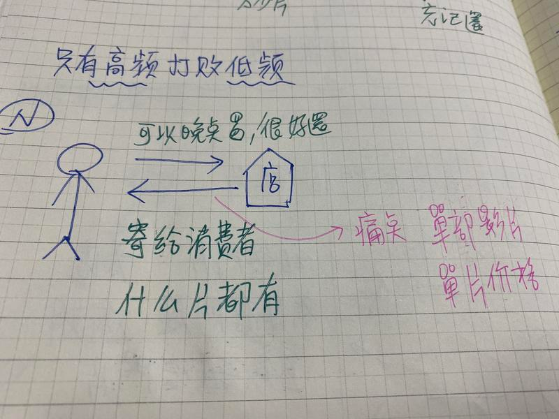
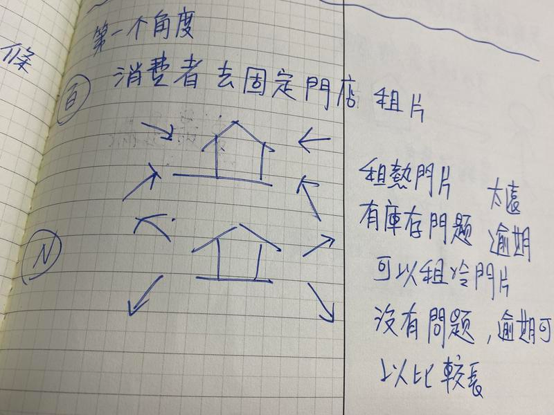
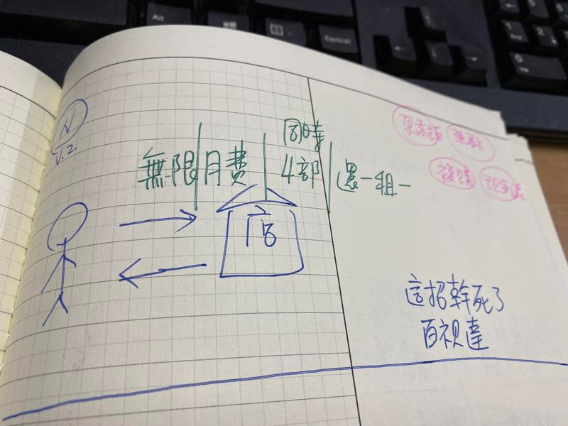
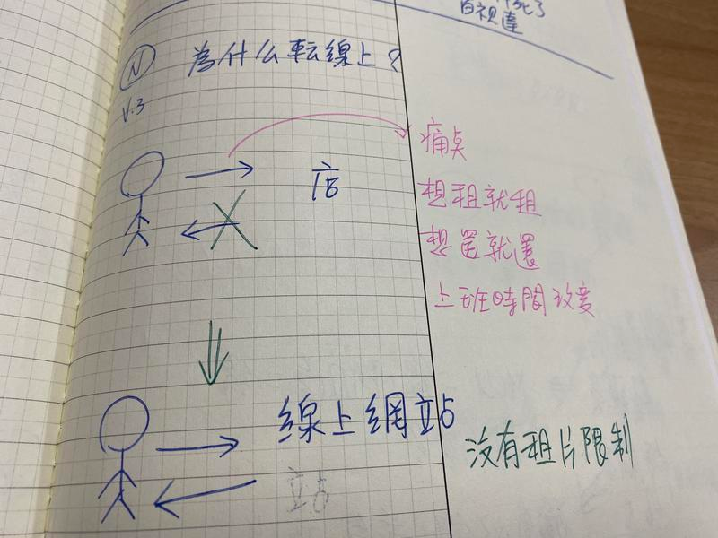
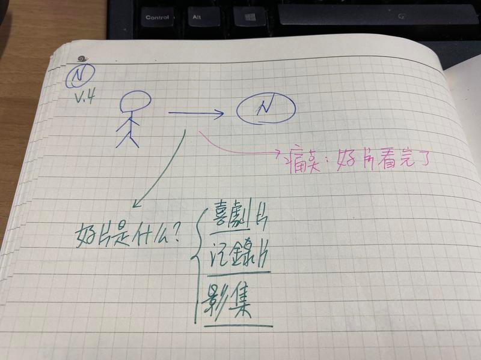
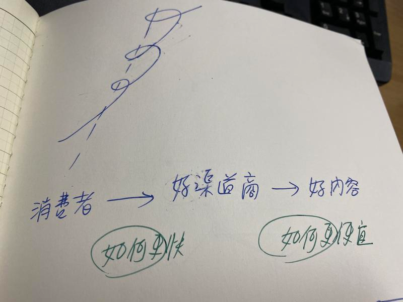

# CH2-螺旋式创新

因为我有一些高速学习技巧，所以学习速度超过一般人。所以职业上跨了很多领域。

在我无意中跨了许多界以后。突然发现，这个世界好像没有新鲜事，所有的新事，好像只是旧瓶装新酒。

几年以前，我在钻研 Growth Hack 门崭新的学问，因为这行领域太新。需要看很多传统的营销书籍钻研原理，再自动化。

我意外的从 Google Books 里面发现，PPPP（Picture => Promise => Prove => Push），这套强力的营销文案技巧。这种写作的技巧，原来 100 年前就已经被发明。

只是当年这个技巧是被用在直销信上。（100年前美国营销是邮购与直销信）而现代营销可能是公众号海报、抖音短视频中。

几年后，我在创新大师 Clayton Christensen 2019 的在经过多年对创新领域的研究以后，在《創新的用途理論》\(Compete against luck\)这本书中，看到了一个崭新的理论 Jobs to be done。

所谓 Jobs to be done 的意思是，「跟一般人对创新的误解与错觉，认为创新是凭空出现」不同。Clayton Christensen 的这个理论指出：其实人类的原始需求都在，只是因为某些协作科技的改变，导致更好的替代方案出现。而这个新方案可能以一种前所未有的样貌出现。故人们误以为是创新。

《創新的用途理論》这本书，原书名是 Compete against luck，中文书名翻译的并不好。英文书名非常传神，其实这本书的主旨就是提出，「创业不需要再碰运气了，比较实际的方法，是认真去解构用户的需求，用新科技打散原本方案的时空与方案结构，搞不好可以找出比原有方案效率更好十倍的崭新解法」。

## 螺旋型增长，而非第二曲线

在 Clayton Christensen 归纳出这个理论出现后。我突然想明白了一个我原本想不明白的现象。其实在企业界谈创新。一直有个我搞不懂的名词，叫第二增长曲线。

我一直觉得这个理论非常莫名其妙。怎么可能突然间企业光靠一个灯泡，灵光一闪，就有了第二增长曲线呢？

而且绝大多数传统企业。基本上无法跨过增长极限。就前浪死在沙滩上了。何论找到什么第二增长曲线。比如百视达来不及转型成 Streaming，就败给了 Netflix。

有了 Jobs to be done 理论以后。

我突然发现这张图，大家的解读角度都错了。如果在 2D 平面上。大家当然无法理解这个第二增长曲线，如何冒出来的。

所以你得这样看

假设我们以 360 度视角来看，每一度是一个需求点，那么需求是一直存在的。

只是他不存在平面上。而存在 360 度上的螺旋线上。

你看到的增长是从一个视角上的切斜面。这个视角是被大家所熟知，才被看成一个平面。

所以在同一 2D 维度平面上做增长，到一个时间点，市场会断裂消失。

这时候你得 360 旋转，重新寻找需求，360画螺旋线，才能找到第二曲线。我称之为「螺旋型创新增长」。

## Netflix 的第三曲线

Netflix 可以说是当代最创新的一个企业，Netflix 最早也是靠租 DVD 起家，后来成功转型 Streaming，打败百视达。

然而，Netflix 最近不满足于提供串流服务，也跨行拍起片来。

拍片本身其实是一件非常烧钱的事，然而 Netflix 不仅自制影集、自制电影、还不断的实验互动式多结局影片、仿真动画片等。大动作十足，一股要 Reinvent Hollywood 的架势，如此的搔操作，让许多人看不明白。

对此，投资人一度并不是很理解 Netflix 再搞什么鬼。

Netflix 却信心十足的表示，这不是什么问题，他们只有一个目标，就是增加订阅户。

本来我真是看不懂。想说这生意模式这么奇杷，"增加订阅户就可以"。不可能这么简单吧。每个网路公司都这么说阿！

而且他们是吃到饱模式，这样不会倒吧？

观察了一年多，我现在总算是真看明白了。

我本来不是很明白这背后的逻辑。

后来用需求与螺旋理论拆解，我才发现Netflix 成功打败百视达，靠的并不是运气，也不是因为赶上高频宽时代。而是Netflix正确的拆解了需求结构，并利用当代科技，做出了时代所需要的产品。

Netflix = 餐馆生意

很多人一直看不明白 Netflix 是怎么赚钱的。因为 Netflix 之前是做租 DVD 起家的。后来成功转型搞 Streaming。现在变成狂拍自制片。拍片砸钱不手软。

模式所有人都看不懂。公司的股价却不断增长。

很多人对它们财务与操作手法质疑。看了网路上报导， Netflix 也只说这不是什么问题，在财务上只有一个目标，就是增加订阅户。

"增加订阅户"。不可能这么简单吧。每个网路公司都这么声称。

到底 Netflix 有什么独特之道？所到之处，势如破竹。

Netflix，其实本身就是一种餐馆模式。人都需要吃饭。

同样的，人的注意力也需要被满足。（跟吃饭一样）

以前吃饭的时间是固定的。比如说每个人都是固定六七点下班，周末也休假。当时科技就是租 DVD 休闲。

所以影集的模式就是一周一连载。但是随著上班型态改变，科技型态改变。很多人晚上八点是看不了剧的。回到家都 11-12 点了。只剩深夜秀，非常闷。

比喻来说，人作息时钟变了。所以人没办法在晚上八点饭馆开饭，但晚上十一点只剩麻辣小龙虾。

所以人们会怎么做呢？结论是他会去买冷冻便当。也就是变通个方法，去抓隔天出字幕的盗版影集，或者是干脆等连载完一次看个够。

所以 Netflix 的看片特点，就如同随时可微波的便当一样，随时可吃，并且允许一次吃七个便当。

## Netflix 如何打败百视达？

当然，Netflix 也不是一开始就这么厉害的。而是一间小公司。

在很久以前 VHS 与 DVD 还盛行时，大家都是开车到百视达去租片的。当时看片需要单片出租，有严格时间限制，并且有高额违约金。

Netflix 剛創業時的角度，從消費者的痛點切入：

* 需要开车去租片 =&gt; 可以请 Netflix 寄给租片者，并且可以邮寄返还
* 店里面租不到冷门片 =&gt; Netflix 租得到
* 逾期宽限时间短 =&gt; 逾期宽限时间长

当然，这使得 Netflix 先取得了市场的一部分份额，但不足以击败百视达。

## Netflix 击败百视达的转捩点：15.95 USD 无限租片

Netflix 真正打败了百视达的设计。是将单片租借制，改成了吃到饱模式。消费者只要付 15.95，手上可以同时有 4 部片子，没有还片期限。还一片就可以再借下一片。

这一步棋彻底解决了消费者的痛点。

原本消费者最大的痛点在于"还片"。很多消费者不是不想还片，而是片真的没看完。但是原先设计还片的机制设计的很死板，逾期金很高。

Netflix 一举取消了逾期金这件事。且改为月费吃到饱。让消费者觉得十分划算。

且每个月缴纳费固定费用这件事。大大保障了 Netflix 的现金流。自此以后，Netflix 业绩开始大幅增长。

## 第二曲线：DVD 租赁改为串流

后来，随著科技进步。Netflix 决定开拓线上串流市场。起初，因为频宽昂贵，这项业务是非常赔钱的。许多股东也非常的不谅解。

但是，Netflix 毅然而然的转型。从 DVD 转型线上主要解决了两件事

* 消费者租片能够更快，随时随地都能看片
* 消费者租片这个环节，再也没有还片环节

Netflix 当时起步时，是用了 3000 万美元与 StartZ 谈了2500部电影与影集的播放权利。4年到期后，StarZ 将续约费用提高到 3 亿美元，Netflix 拒绝了。

Netflix自己不拥有影片版权，而与第三方谈时间与部数的痛点是：片库有限，消费者始终会看完站上热门票。并且版权续约费用昂贵。

所以有短时间，Netflix 上面新增了大量 Standup 喜剧、纪录片、老影集。因为这些片子版权费用低，而且深受消费者喜好。

后来 Netflix 摸清楚消费者需求后，又开启了另外一环变革。

## Netflix 第三曲线：重新发明好莱坞

因为版权费用太贵。Netflix 开启了自制剧集之路。并且目前尝试重新发明好莱坞。

这背后的原因是，消费者一直有看好片的需求。

然而，好片的定义是什么？

一般来说，「好片」可以拆解成两个元素「好演员」+「好剧本」。

而有名气的好演员（如钢铁侠）一般来说非常贵。Netflix 近来大量了启用 MCU 的其他演员（美国队长、猎鹰），来拍 Netflix 的影集与电影。

利用 MCU 的名气来引流，但实际上成本降低许多。

另外，好剧本的定义见仁见智，并非剧情高潮迭起，才能称之好剧本。在串流平台上，能够西引用户的反而是喜剧、做菜节目、悬疑纪录题材。

因此，Netflix 甚至推出了由钢铁侠导演强法洛主持的做菜节目，首集竟然有许多漫威演员出镜，如钢铁侠与蜘蛛人。吸引了更多粉丝。

本质上，消费者有消费好内容的需求。以前从每天一次，只能在电视机前面。到了每天数次，在家中各个角落。

而 Netflix 就是当中的渠道商，第一阶段：致力于消费者更容易取得影片，更少麻烦。第二阶段：致力于让好内容取得的费用更便宜。

## 小龙虾炒饭

感觉这个例子很硬。我换个白话文说法。我在跟朋友介绍这个例子时，总会取笑 Netflix 这个手法叫做开「小龙虾炒饭 Buffet」店。

为什么叫小龙虾炒饭 Buffet 店呢？

当理解了 Netflix 本质上做的是餐馆生意后。接著，我们再来拆解为什么一般海鲜 Buffet 不怕人家吃的原因。

市面上的海鲜总汇 buffet，本质上能够获利的原因，在于这些吃到饱的餐厅，背后股东通常有自营渔船，所以他们等于是成本价倒货在卖海产，比卖到市场去合算多了。而且店面又是收现金...，而不是出货等 90 天开票。

所以 Netflix 表面上是连锁 Buffet 吃到饱。本质上却是直销海产倒货...

那么 Netflix 只收月费，如何解决爱吃的大食客问题？开 Buffet 都担心一件事。真有人来狂吃高价海鲜怎么办。

解决方法就更简单了。虽然 Netflix 号称自己高级海鲜吃到饱。（都是好莱坞一线影星拍的片）

* 第一，没人进店就一直狂吃龙虾，只吃吃龙虾也会吐。同常也会尝试其他菜色。
* 第二，Buffet 这种店往往菜色多元。推出很多便宜好吃的品项去垫满顾客的胃。比如说港式茶点。一般人，往往在店里吃多一点低成本的肠粉、炒饭、日式寿司，瞬间就饱了。比如说我因为觉得要招待我爸妈吃好料的。所以带它们去海鲜总汇。但我爸爸每次去拿的是吃炒饭炒面...

所以本质上 Netflix 的手法，就是号称自己店里有卖波士顿龙虾，而且可以吃到饱。吸引越来越多人来餐厅吃饭。但是实际上餐厅里供应最多的是小龙虾炒饭。

所谓的小龙虾炒饭就是 Netflix 的自制剧。自制剧省钱，于是 Netflix 就这样干。

这里可以举一堆例子

* 像班艾佛列克的 triple frontier，他演到一半在剧中就死了（抱歉，我不是故意要剧透）。我在看这部片时看到一半也就觉得WTF....
* 像 Ali Wong（女喜剧演员）的「我可能不会爱你」，里面请了基努李维客串了15min。我真的是为了看基哥跟 Ali Wong 亲吻才来看的....
* 不仅如此，Netflix 请了一堆好莱坞二线演星吸流量。比如说美国队长、猎鹰Falcon、阿凡达里面的 Sam Worthington 来演影集。这些都是吃了很重的 MCU、阿凡达流量。但演员却拿不到好 pay。你一定会很想看美国队长在 Netflix 上的影片对吧？

所谓的小龙虾炒饭就是这样操作的：

* 美国队长演了「紅海深潛密援」，这部片改编自真实故事，救援非裔以色列人。如此猎奇故事，你一定会想看吧。纪录片+MCU。
* 猎鹰演了「黑镜第五季第一集」，里面剧情是两个黑人死党，因为玩一个虚拟实境的快打旋风，各为男女角，结果在里面肉体出轨了起来。里面饰演的电玩角色是亚洲男女。它们在电玩里的肉体关系不可自拔。如此男男的恋爱故事，特别吓掉你的下巴。更过份的是，亚洲男女演员负责 fuck 的是不出名演员...节省成本
* 基努李维客串的「我可能不会爱你」，是亚洲男女喜剧恋爱片。是 Ali wong（知名喜剧女星）与 Randall Park（美剧喜剧影集 Fresh off the boat），如果只有它们两个演，肯定没人看。但加上基哥，我怎么都会看阿。而且基哥出场都已经中段了。

如果你是 Netflix 爱好者。看到这里你会开始觉得 Netflix这家公司真是搔，套路深不见底。

## 创新的解法飘在 3D 维度里

这个案例，我之前在网路上发表。很多读者看了拍案叫绝，发现终于自己看懂了 Netflix 的创新由来。

Netflix 的创新一直不是拍脑门，而是另外一层的换维手法。

Netflix 不跟现有的敌人在原有的平面竞争，而是将所有的痛点都抽出来，沿著「现代 Device」（mobile phone）打造解法，形成了另一个优势增长曲线。

而 Netflix 现在的重新发明好莱坞计画，也是将「拍片成本」的「痛点」抽取起来，利用解构制作成本（明星、剧本）以及观众喜好（喜剧、纪录片、猎奇片、漫威明星）大数据的优势，形成了另外一条成本优势成长曲线。

原本我们在「创新竞争」这个领域，通常只会关心对手做什么，我们就做什么，去拼价格、品质、速度。这是直线思维的竞争。

如果你去解构特斯拉的发明，你会发现特斯拉的诞生，也不是拍脑门，而是利用 18650 电池科技与 AI 数据，环绕著消费者痛点，形成了另外一个维度的螺旋创新。

这就是为什么在开本书的一开头，我们要先提「维度」概念。

当你有了「换维」的思维。很多不可能的问题就变成了可能，甚至还能跨界找到答案。
